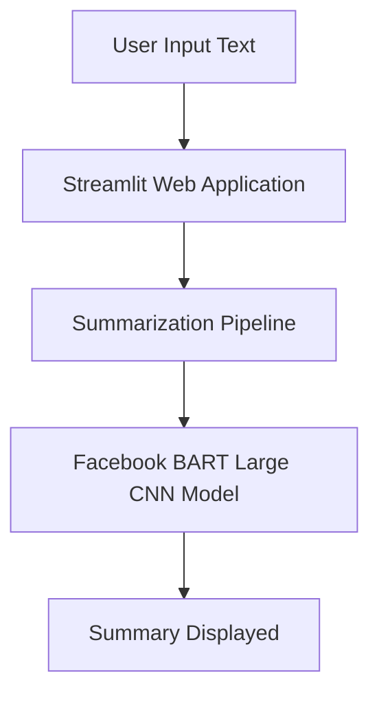

# Document Summarizer

**Document Summarizer** is an intuitive web application built using Streamlit and Hugging Face's Transformers library. The app uses the powerful `facebook/bart-large-cnn` model to generate concise summaries from pasted text inputs. It is designed with a futuristic, dark-themed user interface enhanced with neon-blue accents.

## Key Features

- **Futuristic UI:** Engaging dark theme with vibrant neon highlights.
- **Instant Summaries:** Leverages advanced Hugging Face summarization model.
- **User-Friendly Input:** Simple text area for pasting content.
- **Responsive Design:** Accessible on various devices and screen resolutions.

## Architecture Diagram



## Installation Steps

### 1. Clone the Repository

```bash
git clone <YOUR_REPOSITORY_URL>
cd <YOUR_REPOSITORY_DIRECTORY>
```

### 2. Create Virtual Environment

```bash
python -m venv venv
source venv/bin/activate # On Windows: venv\Scripts\activate
```

### 3. Install Dependencies

```bash
pip install streamlit transformers
```

### 4. Run the App

```bash
streamlit run app.py
```

## Deployment

- **Streamlit Cloud:** Directly deploy - 


## License

This project is licensed under the MIT License. Refer to the LICENSE file for further details.


